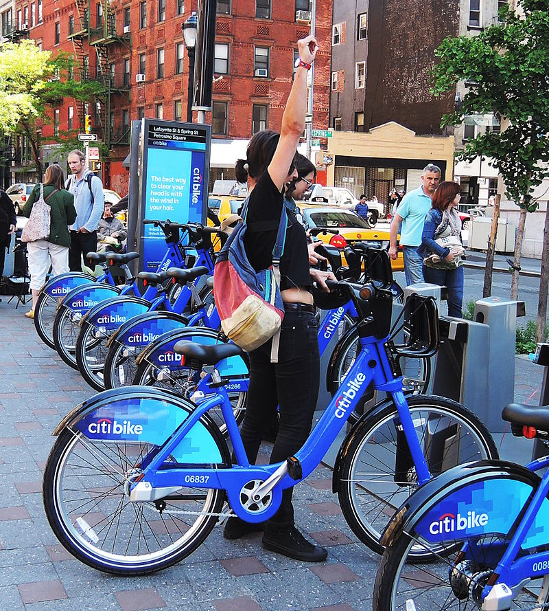
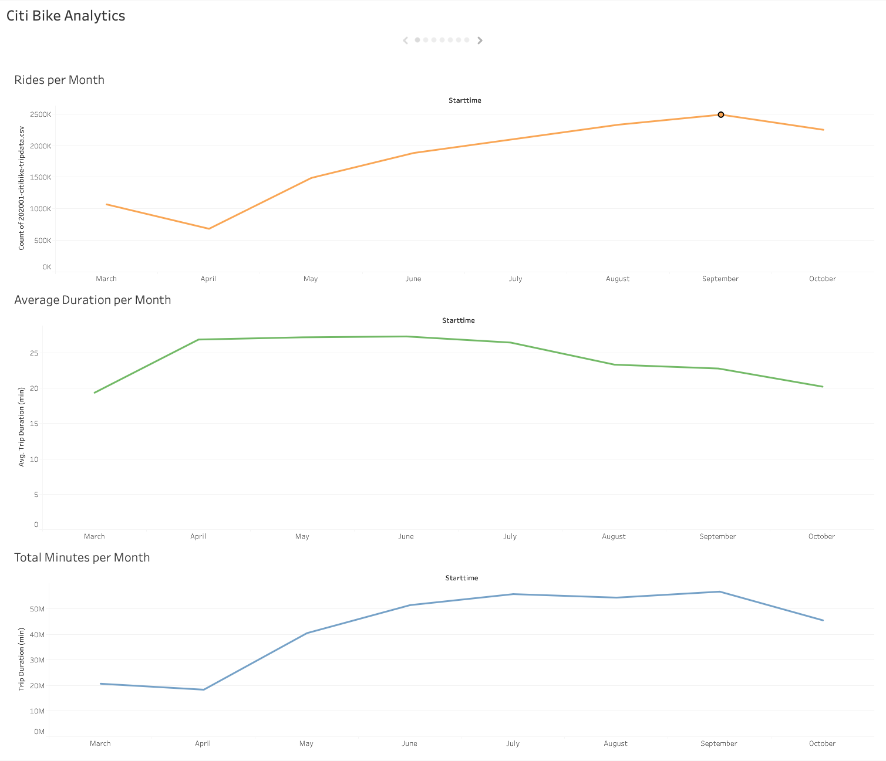
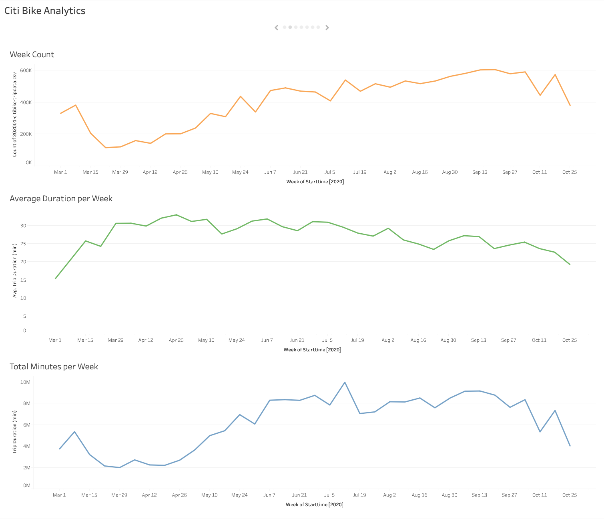
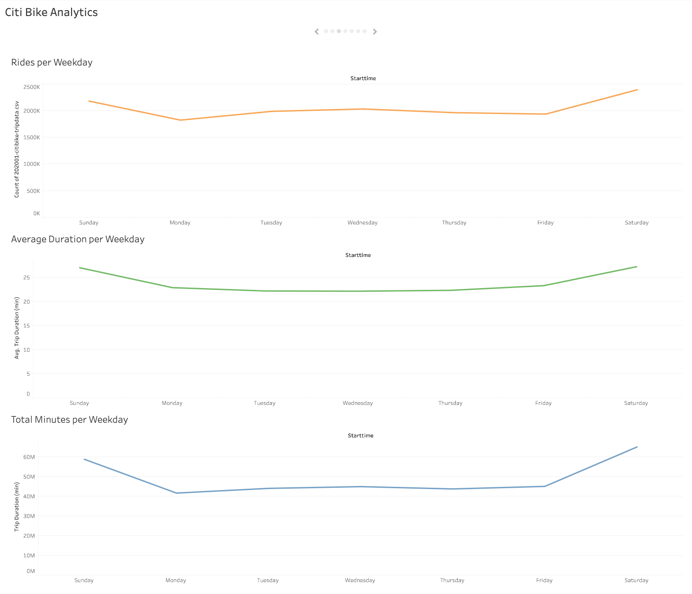
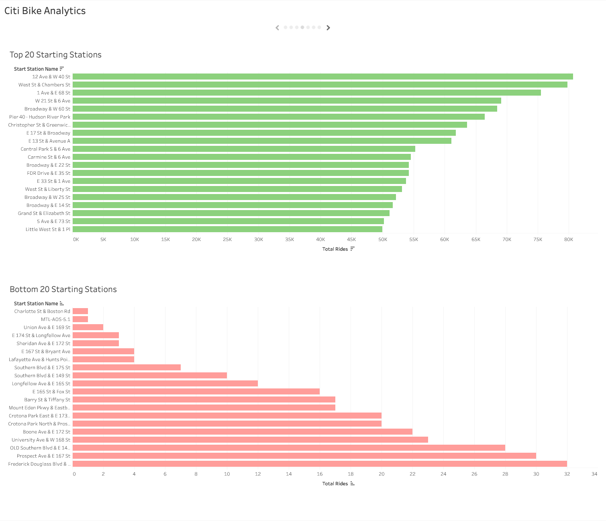
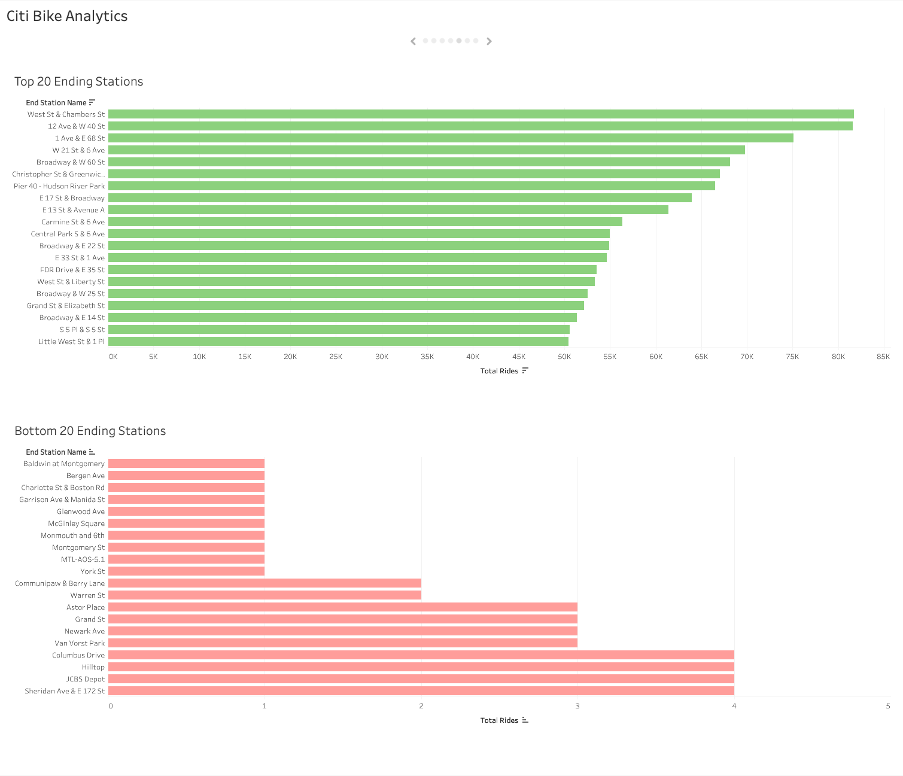
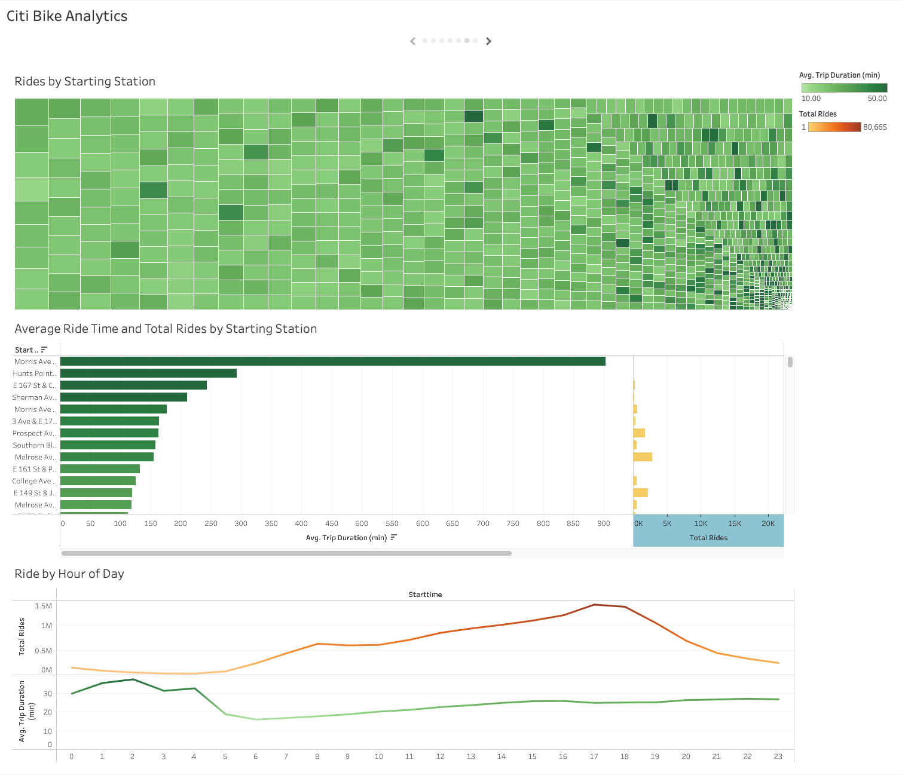
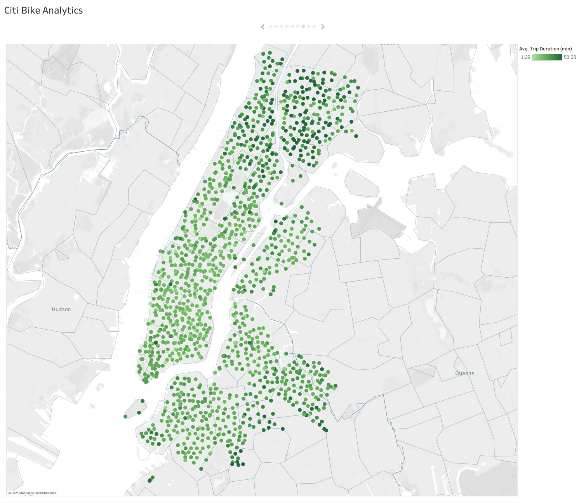
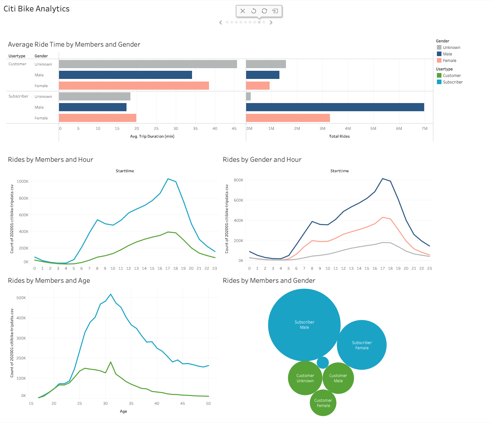
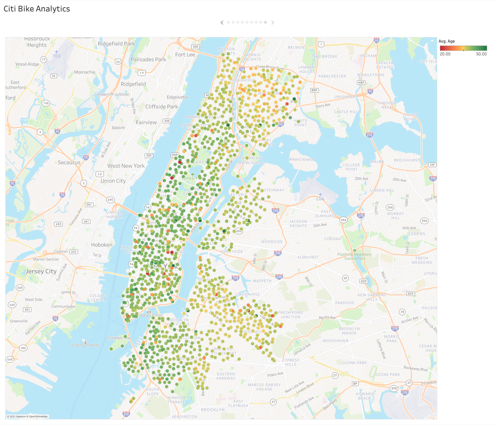

# Tableau Homework - Citi Bike Analytics

## Background

Congratulations on your new job! As the new lead analyst for the [New York Citi Bike](https://en.wikipedia.org/wiki/Citi_Bike) Program, you are now responsible for overseeing the largest bike sharing program in the United States. In your new role, you will be expected to generate regular reports for city officials looking to publicize and improve the city program.

Since 2013, the Citi Bike Program has implemented a robust infrastructure for collecting data on the program's utilization. Through the team's efforts, each month bike data is collected, organized, and made public on the [Citi Bike Data](https://www.citibikenyc.com/system-data) webpage.

However, while the data has been regularly updated, the team has yet to implement a dashboard or sophisticated reporting process. City officials have a number of questions on the program, so your first task on the job is to build a set of data reports to provide the answers.

## Analysis

The data analized accounts for over 14 million records from March to October 2020 that contained the following information:

- Ride ID
- Rideable type
- Started at
- Ended at
- Start station name
- Start station ID
- End station name
- End station ID
- Start latitude
- Start longitude
- End latitude
- End Longitude
- Member or casual ride

After analyzing the data we found the following trends and insights from the information. 

### Total number of Rides per Month

The difference in demand for total rides is huge, more than double in August/September than in March/April. This is explained due to the effects of the Pandemic and it is also likelier that a person rides in a warmer weather. There is a trend developing towards a decrease in average duration time per ride. 

### Total number of Rides per Week

The effects of the pandemic are observed more clearly when looking at the same data by week. Demand seems to be taking a strong dive in the last weeks of October, might be a good time to give maintenance to the most used bikes. 

### Total number of Rides per Weekday

In a weekday grouping there is a stronger demand for bikes on weekends than on weekdays, not only is the amount higher but also the average time per ride. 

### Top and Bottom 20 Starting Stations

There is a huge difference between stations, the 20 most popular have over 50,000 rides while the bottom 20 had less than 50. 

### Top and Bottom 20 Ending Stations

Similar to the previous analysis, this information will also be useful to determine the amount of bike shortage due to the diference of variation in demand depending location. 

### Stations Dashboard

In the following dashboard there are various ways to view the information of each station. The treemap on top has each station on a box where its size is determined by the amount of Rides and the color by the average duration of the trip. On the ride by hour of the day, the busiest time is from 4pm-7pm and rides tend to have a higher average duration late afternoon than early in the morning. 

### Map by Duration

Most of the north part of the map and on the outer parts in the south rides have a much higher average duration than those close to the center, it seems riders enjoy more riding towards the city than leaving it in a bike. 

### Members and Gender Dashboard

On the first pair of charts, there is no clear difference between gender for the Average Duration of a Trip however it is significant between Customers and Subscribers, it almost doubles for Customers as they don't ride as often as subscribers. It is also important to note that there are almost twice as much Male Subscribers than Female Subscribers. The bikes are most popular between age group of 25-35 years old. 

### Map by Age

On the final visualization we have a map that shows the average age for each station, as you move away from the center age tends to go towards the mean of 35 years while close to the center you have a lot of green or older people. And there are very fewer stations that have average ages of under 25 years. 

Please click in the following link to see the full visualizations in my Public Tableau. 
[Citi Bike Analytics 2020](https://public.tableau.com/views/CitiBikeAnalytics2020_16284934425160/CitiBikeAnalytics?:language=es-ES&:display_count=n&:origin=viz_share_link)
